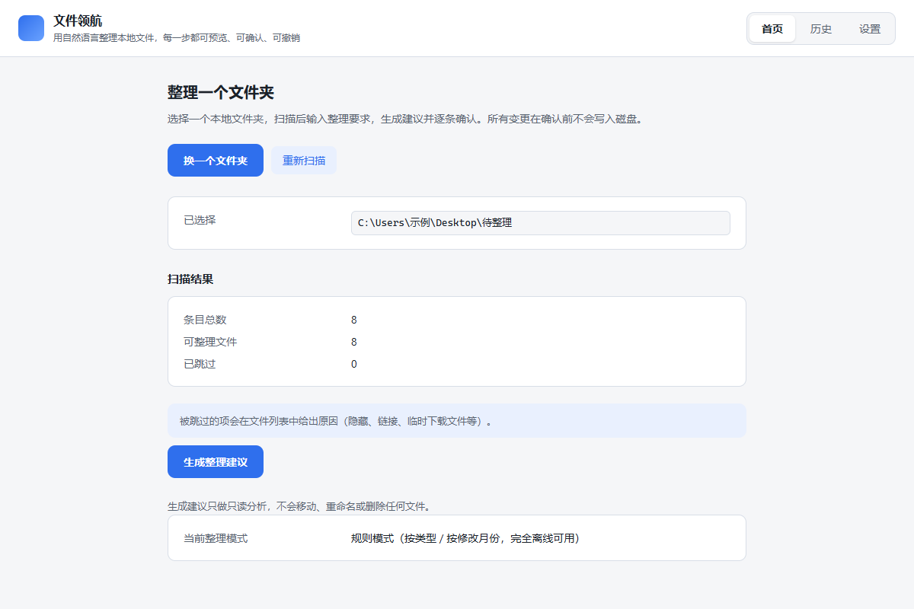
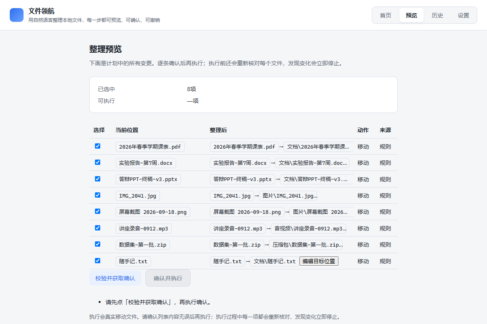
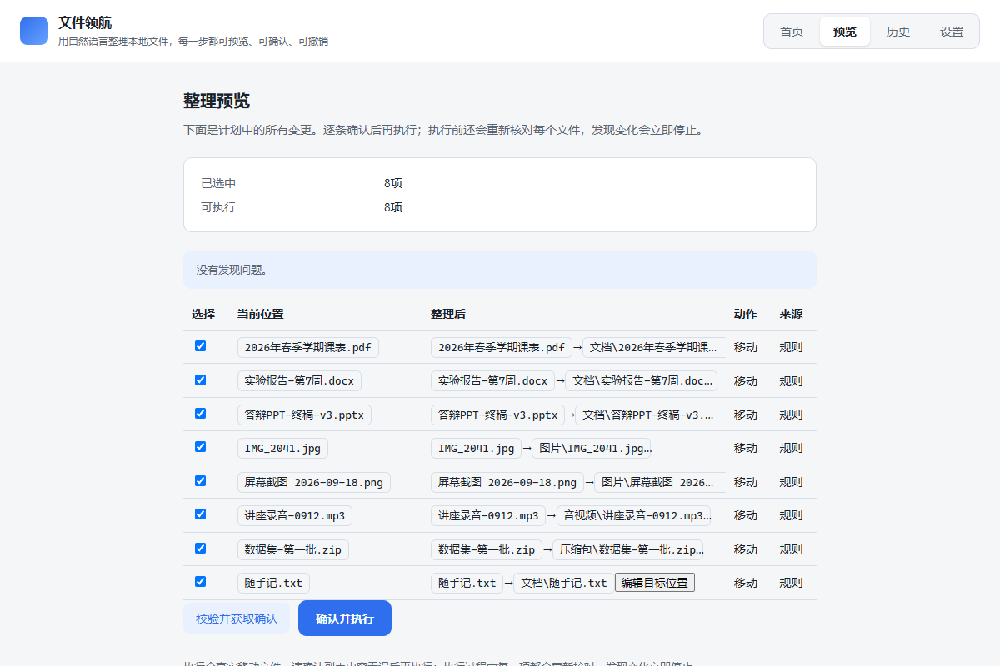
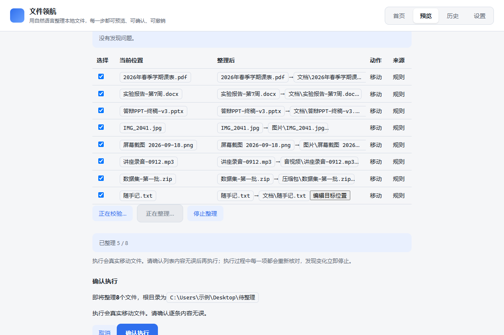
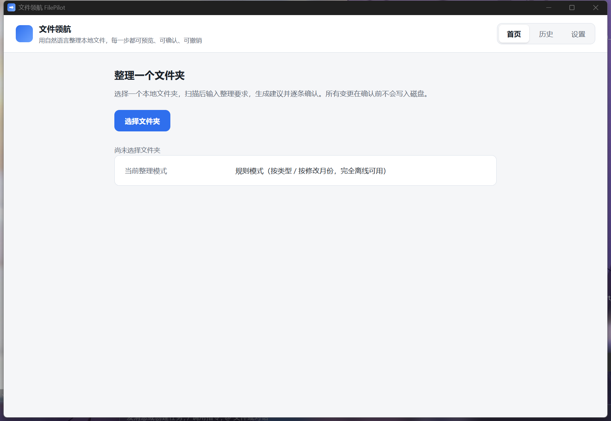

# FilePilot（文件领航）

用自然语言整理本地文件夹。**AI 只产生结构化建议**——确定性规划器与安全执行器
负责校验和执行；所有文件变更都可预览、可确认、可追踪，并在满足条件时撤销。

- 平台：Windows 11 x64（首版仅支持 Windows）
- 许可证：MIT（见 [LICENSE](LICENSE)）
- 第三方组件：见 [THIRD_PARTY_NOTICES.md](THIRD_PARTY_NOTICES.md)

---

## 30 秒了解 FilePilot

一次整理的完整路径只有五步，每一步都能停下来检查：

1. **选择文件夹** —— 明确授权一个目录，应用不碰授权之外的任何文件
2. **扫描** —— 只读元信息；跳过隐藏/系统文件、`.git`、`node_modules`
3. **生成建议** —— 规则模式（离线）或 AI 模式（本地模型 / 云端 API）
4. **预览并确认** —— 逐项看到「谁 → 去哪、为什么」；可取消勾选、可改名
5. **执行** —— 逐项记录日志；整理错了可以**预览式撤销**

| 首页：扫描结果 | 预览：逐项确认 |
|---|---|
|  |  |

| 确认：一次性授权 | 执行：逐项进度 |
|---|---|
|  |  |

**装完之后的样子**（NSIS 安装包的实机启动截图）：



> 上面四张来自真实界面渲染（契约数据由 `tests/e2e/` 的合成夹具驱动，
> 不含任何真实用户文件）；最后一张是**安装版**启动后的实机截图。

## 两种整理模式

| | 规则模式 | AI 模式 |
|---|---|---|
| 网络 | **完全离线** | 本地模型（Ollama）或云端 API |
| 依据 | 扩展名分类 / 修改月份 | 文件名 + 提取的内容摘要 |
| 适合 | 快速归类下载、桌面 | 按主题、项目、用途整理 |

**本地存储 ≠ 本地推理。** 扫描记录、操作日志始终存在你自己的电脑上；
只有 AI 模式使用**云端 API** 时才发生网络发送，且发送前必须经过
「预览待发送内容 → 明确授权」这一步。

### AI 模式实际发送什么（也只发送这些）

- 随机分配的文件编号（不含真实路径）
- 文件名、扩展名
- 每个文件最多 2,000 字符的文本摘要（可在预览中**逐文件关闭正文**）
- 你写的整理要求（最多 1,000 字符）

**不发送**：绝对路径、用户名、完整文件、原图。
改变要求、正文范围或提供商都会让旧授权自动失效，必须重新预览、重新授权。

- **本地模式**：只接受 `127.0.0.1` / `localhost` 端点（如 Ollama），
  不经过系统代理，不会偷偷转去外网。
- **云端模式**：**模型服务与密钥都由你自备**——本项目不提供、不代管、
  不转售任何模型服务。API Key 只存入 **Windows 凭据管理器**，
  不进数据库、不进日志；应用里只保存一个凭据引用名。
  兼容端点必须是你自己填写的 HTTPS 地址。

## 安装

1. 从 Releases 下载 `FilePilot_*_x64-setup.exe`。
2. 双击安装。**不需要管理员权限**（仅安装到当前用户）。
3. Windows 会提示「未知发布者」——**安装包目前没有代码签名**，
   这是预期现象，不是文件损坏。核对发布页的 **SHA-256** 与你下载的文件
   一致后再继续（PowerShell：`Get-FileHash .\FilePilot_*_x64-setup.exe`）。
4. 依赖 **WebView2**：Windows 11 通常已自带；缺失时安装包会引导安装
   （这一步需要联网，应用本身的规则模式离线可用）。

**不要**为了让安装通过而关闭杀毒软件或 Windows 安全功能——
本应用不需要、安装说明也不会要求你这么做。

## 最短上手

1. 打开 FilePilot → **选择文件夹**（建议先拿一个可以随便试的目录）
2. **开始扫描**
3. 选「按类型整理」→ **生成整理建议**
4. 在预览里逐项检查，**校验并获取确认** → **确认并执行**
5. 整理完想反悔：进入历史记录 → **撤销**（同样有预览和确认）

## 支持的内容提取格式

规则模式不需要读取内容；以下提取只服务于 AI 模式，全部在**隔离的工作进程**
（内存上限 256 MiB、禁止联网、15 秒超时）里完成：

| 类型 | 方法 | 上限 |
|---|---|---|
| TXT / MD | UTF-8 / UTF-16，有限支持 GB18030 | 文件 ≤10 MiB，取前 12,000 字符 |
| PDF | 本地文本提取，前 10 页 | 文件 ≤20 MiB；扫描型 PDF 明确标「不支持」 |
| DOCX | 仅读正文 XML（禁外部实体、禁宏） | 压缩包 ≤20 MiB |
| PNG / JPEG | 解码后调用 **Windows 系统 OCR**（不走云端） | 文件 ≤10 MiB、≤2,000 万像素 |
| 其他格式 | 不提取内容 | 仅文件名/扩展名/时间参与建议 |

## 已知限制（首版）

- **仅 Windows 11 x64**；只支持普通本地 NTFS 目录——网络盘、同步目录、
  联接点/符号链接指向根外的情况会被拒绝或跳过。
- 单次扫描上限 **10,000 个文件**、递归深度 20；超限会明确提示截断。
- 大于 **100 MiB** 的文件标记为超限，不参与整理。
- **撤销有边界**：目标文件被改动过、原位置被新文件占用时，
  该项标为冲突并默认不撤销；撤销只对**当前会话**里的整理开放，
  应用重启后旧会话的操作不再提供撤销入口（历史记录仍可查）。
- 首版只移动文件、不改写内容；只改大小写、互换两个文件路径、
  仅改变扩展名这类操作首版直接拒绝。
- AI 模式单任务上限：200 个文件、30 次模型请求；达到上限会停下并
  显示已完成范围，不会静默继续。
- 安装包未签名（见「安装」一节）；没有自动更新功能。

## 操作记录存放在哪

- 数据库（扫描记录、计划、执行日志）在应用数据目录下的 SQLite 文件中。
- 文本提取缓存默认只存在会话内存；临时文件在应用专用缓存目录，
  任务结束与下次启动时清理。**清缓存不会清操作日志。**
- 卸载只移除程序本身；你的文件和操作历史默认保留。
- **首版不提供「一键清理应用数据」的入口。** 想清就自己删应用数据目录——
  **删掉之后操作历史与撤销记录一并丢失，且不可恢复**；
  应用下次启动会当作全新安装，不会假装还认得那些历史。
  （规格要求「清理必须由用户明确选择，并显示恢复记录会丢失」——
  我们选择不做这个入口，而不是做一个会丢数据的按钮。）

## 问题反馈

到 Issues 提交，并尽量包含：

```text
版本号（设置页可见）：
Windows 版本（winver 的输出）：
做了什么（哪一步、哪个模式）：
预期发生什么 / 实际发生什么：
错误码或提示原文（如有）：
```

**不要**在 Issue 里粘贴：API Key、完整文件路径、文件正文、模型返回原文。
日志里本来就不会记录这些内容；如果你在自己机器上看到了，
请按 [SECURITY.md](SECURITY.md) 的渠道私下报告——那是一个缺陷。

## 从源码构建

需要 Node.js ≥ 22.12、pnpm 10、Rust ≥ 1.98，以及 **Python 3**
（`scripts/` 下的构建与检查脚本用它：把解析工作进程放进安装包、
给产物去掉编译机路径、生成第三方许可证清单）。

```bash
pnpm install --frozen-lockfile
pnpm dev              # 开发模式（Vite + Tauri 窗口）
pnpm desktop:build    # 产出 NSIS 安装包（自动打包解析工作进程、去掉编译机路径）
```

发布前自查（详见 [RELEASE_CHECKLIST.md](RELEASE_CHECKLIST.md)）：

```bash
python scripts/scan-release-content.py   # 产物里有没有真实路径/密钥，命中即非零退出
python scripts/third-party-notices.py    # 重新生成依赖许可证清单
```

常用检查：`pnpm typecheck`、`pnpm lint`、`pnpm test`、`pnpm test:e2e`、
`cargo test --manifest-path src-tauri/Cargo.toml`。
详见 [CONTRIBUTING.md](CONTRIBUTING.md)。

## 许可证

MIT。贡献代码即表示同意以 MIT 发布，见 [CONTRIBUTING.md](CONTRIBUTING.md)。
